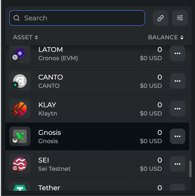

# Assets and Prices API

## Getting Started

This guide will help you get started with the Assets and Prices API.

The Assets and Prices API is a free API that provides real-time and historical data on assets and prices for various blockchains. The API is designed to be easy to use and provides a wide range of data, including:

- Asset information, such as name, symbol, and decimals
- Price information, such as current price, market cap, and 24-hour trading volume
- Historical price data, such as price changes over time

The API is available for a wide range of blockchains, including Ethereum, Binance Smart Chain, and Solana, and supports a variety of assets, such as tokens, coins, and NFTs.

The base URL for all API endpoints is: `https://gql-router.xdefiservices.com/graphql`.

## Get Assets Tokens

Get Assets Tokens provides information about tokens on various blockchains, including Ethereum, Binance Smart Chain, and Solana. The API returns data such as the token's name, symbol, icon, market cap, price, and contracts.

[Query GraphQL directly here](https://gql-router.xdefiservices.com/graphql?explorerURLState=N4IgJg9gxgrgtgUwHYBcQC4QEcYIE4CeABAKIAeAhnAA4A2CAiroQBQAk1FA5gukQMIQkSBFBQBLIQEE8XAM4BCADRE2FAGYp8fACIUtAFXGIVazfgAKecVF5E9h4wlPrxtLXj4GIAa2QAxNw8ASiJgAB0kIiIKOTkEFDkwyOjolF9kORZOHj4ObmcY809VDQ8VMstrWzzKvCsbQtd3bVVmkOSo1OichAcKTu7uqAgYVBSh6NpjcRQJyYh1dXi5ru6AX3nU3sHJol6ASSR1CF29omQwfhg8OQg8LcmAC1iAOQQyFAsCx9TNtaGCDAPCSEQBkyQEDACDO5yI4jAvwhVAQSKGcgIcAARhBaGjujYhPjUnAKHg-Ch%2BBRqMSetUYWC4UMqKNxuC4XIoBRpkguP4KGJ7rSiP8mdERqg8ALErCmRjsbjhdFOdzxLz%2BYKHuzzhQwGA8Ag4kqiFAXmrjQjhaK4dbJra-ltrf9-iAlCAAG5k8QULH0OQYECMojhEC9EN8IPREOuW5zDBEACMSi2IaxCBOBvDRCQMFotGTAJDdSzObzBe6IdosTjfFLeK663LwZAxfjdabReKDVsJdz%2BYm0aC%2BCzkebuv1hrkvbLKZApooaqnbb7TajIARS9rK9n8pxtE32b7E2drtDEDkKHU0y4TxQAHlqPh9JIkABlKDWahoTAgdZAA)

::: code-group

```javascript [Example]
const GRAPHQL_ENDPOINT = "https://gql-router.xdefiservices.com/graphql";

const query = `
  query Tokens($page: ConnectionArgs!, $after: DateTime, $afterPrice: DateTime, $filter: TokenFilter) {
    assets {
      tokens(page: $page, after: $after, afterPrice: $afterPrice, filter: $filter) {
        pageData {
          count
          limit
          offset
        }
        page {
          pageInfo {
            endCursor
            hasNextPage
          }
          edges {
            node {
              id
              name
              symbol
              icon
              marketCap
              price {
                amount
                scalingFactor
              }
              contracts {
                symbol
                scalingFactor
                address
                chain
                id
              }
            }
          }
        }
      }
    }
  }`;

const vars = {
  page: {
    first: 5,
    before: null,
    after: null,
    last: null,
  },
  after: null,
  afterPrice: null,
  filter: {
    address: null,
    chains: null,
    ids: null,
    symbols: null,
  },
};

const getAssetsTokens = async () => {
  await fetch(GRAPHQL_ENDPOINT, {
    method: "POST",
    headers: {
      "Content-Type": "application/json",
    },
    body: JSON.stringify({
      query,
      variables: vars,
    }),
  })
    .then((response) => response.json())
    .then((result) => {
      console.log(result);
      // Handle the result
    });
};

getAssetsTokens();
```

```js [Variables]
{
  "page": {
    "first": Float,
    "before": String | null,
    "after": String | null,
    "last": Float | null
  },
  "after": DateTime | null,
  "afterPrice": DateTime | null,
  "filter": {
    "address": [String!] | null,
    "chains": [AssetChain!] | null,
    "ids": [String!] | null,
    "symbols": [String!] | null
  }
}
```

:::

<div ref="refAssetsTokens"/>

## Get Assets Crypto Currencies

Get Assets Crypto Currencies provides information about cryptocurrencies on various blockchains, including Ethereum, Binance Smart Chain, and Solana. The API returns data such as the cryptocurrency's name, symbol, icon, type, external data, scaling factor, chain, market cap, and price.

[Query GraphQL directly here](https://gql-router.dev.xdefiservices.com/graphql?explorerURLState=N4IgJg9gxgrgtgUwHYBcQC4QEcYIE4CeABAMKEAOKEJMeeyUAlggM4AUAJOQIYDmC6UhCRIEUFI2EBBPLxYBCADREOAM0YAbFPkFkClarXpIoBAGKbteZR26qrABTyMoAogBFu2gCqNENuytBTx8-BABKImAAHSQiIm4WFgQUFijY%2BPioCioaOgZmdh5%2BQS4%2BBGV1LR0VKqtlQPwnFzdbeybnVwb2vFLGvEiYuMz44oQQ7nThkayIGFQMmfiNP0YURaWIVVVk9enMgF8NzLGppdHygEkkVQgz8-iAC0SAOQQADxQHcuOl5DA8iwIHhfodQfEEGB%2BGkhg94kgIGAEPc4URGGBwTMkNxEJiRiwCHAAEYQDR4zIuYTk%2BIofQIalED5WbEaCYMuDcPAAaxSJG45AZLCg3BWSF4Zm44mBDKgz0YSAZ5E6yNhqMyOLmC32DyO2pmup1oINYOGuoOIEUIAAbpzGNwiRpWBgQKroiAxm7BKr4m71HgWOsMEQAKyKY5u-qeohIGAaMmmsPDX2WfBR71EN2y7jylhRmNxxMjN3o3NB-MaQuZN0E4mk0uCcuLA6ViM9ZquPOxiuLVtWTtx2Lmy3kCAB1QrXiPFAAeXI%2BC8kiQAGVsoxKM6QAcgA)

::: code-group

```javascript [Example]
const GRAPHQL_ENDPOINT = "https://gql-router.xdefiservices.com/graphql";
const query = `
  query CryptoCurrencies($page: ConnectionArgs!, $filter: CryptoCurrencyFilter, $afterPrice: DateTime, $after: DateTime) {
    assets {
      cryptoCurrencies(page: $page, filter: $filter, afterPrice: $afterPrice, after: $after) {
        pageData {
          count
          limit
          offset
        }
        page {
          pageInfo {
            hasNextPage
            endCursor
          }
          edges {
            node {
              id
              name
              symbol
              icon
              type
              externalData
              marketCap
              scalingFactor
              chain
              price {
                amount
              }
            }
          }
        }
      }
    }
  }`;

const vars = {
  page: {
    first: 5,
    after: null,
  },
  filter: {
    chains: null,
    ids: null,
    symbols: null,
  },
  afterPrice: null,
  after: null,
};

const getCryptoCurrencies = async () => {
  await fetch(GRAPHQL_ENDPOINT, {
    method: "POST",
    headers: {
      "Content-Type": "application/json",
    },
    body: JSON.stringify({
      query,
      variables: vars,
    }),
  })
    .then((response) => response.json())
    .then((result) => {
      console.log(result);
      // Handle the result
    });
};

getCryptoCurrencies();
```

```js [Variables]
{
  "page": {
    "first": Float,
    "after": String | null
  },
  "filter": {
    "chains": [AssetChain!] | null,
    "ids": [String!] | null,
    "symbols": [String!] | null
  },
  "afterPrice": DateTime | null,
  "after": DateTime | null
}
```

:::

<div ref="refAssetsCryptoCurrencies"/>

## Get Assets Fiat Currencies

Get Assets Fiat Currencies provides information about fiat currencies on various blockchains, including Ethereum, Binance Smart Chain, and Solana. The API returns data such as the fiat currency's name, symbol, scaling factor, character, and price.

[Query GraphQL directly here](https://gql-router.dev.xdefiservices.com/graphql?explorerURLState=N4IgJg9gxgrgtgUwHYBcQC4QEcYIE4CeABAGICWAhigMIx57JRkIDOAFACQAOFA5guiLUISJAigoyIgIJ5eLAIQAaIhwBmZADYp8g8lVr1GBctvwqOFNTryCAIlQQAVMogtWbABTxkoAog46LogAlETAADpIREQULCwIKCzhUTExGgZ0DEhMrGw8-ILcfAgqGma2quU2Kh66qnV4tdb43r7%2Bli14bX5hkdFpMQUIgRQpA4MxUBAwqKmTMZquZCjzCxBqagmrE2kAvmtpw%2BMLQyUAkkhqECenMchghiwQeIcLABZxAHIIAB4onhKb32wPuYH4yX6dxiSAgYAQt2hRDIYFBkyQFEQaMGLAIcAARhBNNi0iwoBQlkheCQKBIXiSpp88LSbAyiFwfH5EUjYnAZnNdncDoLJsKhcCxSCBsK9iAlCAAG4UHwUfGaVgYEBQogREDDXWCbUxXUaPAsVYYIgAViUh11jQNRCQME0xOltoGJq0rMtRp1IBRLEdztd8z2HuNIAdlpDmgj-saPQQwZdbtl8q4EHNaiWvHeKAA8lx8FQpEgAMpQHxcNCYEB7IA)

::: code-group

```javascript [Example]
const GRAPHQL_ENDPOINT = "https://gql-router.xdefiservices.com/graphql";
const query = `
  query FiatCurrencies($page: ConnectionArgs!, $filter: FiatCurrencyFilter, $after: DateTime, $afterPrice: DateTime) {
    assets {
      fiatCurrencies(page: $page, filter: $filter, after: $after, afterPrice: $afterPrice) {
        pageData {
          count
          limit
          offset
        }
        page {
          pageInfo {
            endCursor
            hasNextPage
          }
          edges {
            node {
              id
              name
              symbol
              scalingFactor
              character
              price {
                amount
              }
            }
          }
        }
      }
    }
  }`;

const vars = {
  page: {
    first: 5,
    after: null,
  },
  filter: {
    ids: null,
  },
  after: null,
  afterPrice: null,
};

const getFiatCurrencies = async () => {
  await fetch(GRAPHQL_ENDPOINT, {
    method: "POST",
    headers: {
      "Content-Type": "application/json",
    },
    body: JSON.stringify({
      query,
      variables: vars,
    }),
  })
    .then((response) => response.json())
    .then((result) => {
      console.log(result);
      // Handle the result
    });
};

getFiatCurrencies();
```

```js [Variables]
{
  "page": {
    "first": Float,
    "after": String | null
  },
  "filter": {
    "ids": [String!] | null
  },
  "after": DateTime | null,
  "afterPrice": DateTime | null
}
```

:::

<div ref="refAssetsFiatCurrencies"/>

## Get LP Tokens

Get LP Tokens is fully the same structure as Get Assets Tokens but it’s like "Low Priority" tokens. The API returns data such as the LP token's symbol, scaling factor, address, chain, fees, defi protocols and external data.

[Query GraphQL directly here](https://gql-router.dev.xdefiservices.com/graphql?explorerURLState=N4IgJg9gxgrgtgUwHYBcQC4QEcYIE4CeABADIAKAKhANbIDOAFACQAOAhgOYLpEDCESJAigoAlgICCeDnQCEAGiJMAZqIA2KfDyq0kAMXWa8ipm2VGeAETaaKoxCbNGyeUVG5Frt%2BwgCURYAAdJCIiNjo6BBQ6AODQ0LUWHXoGdi4eVk4ERVUNLSVco0UnfNNzfGLyvBc3DzLnV3d-IJD40LSELzZY1rbQqAgYVDi%2BhPtRFBHRiGVlSMne%2BIBfKfiOntH2rIBJJGUIDc3Q5DBeGDw6CDxV0YALcIA5BAAPFDIsm%2BXP47AuGJajqEkBAwAhDoCiANUHg2CJ-t9NqIwAjRnQCHAAEYQNQovp0KBsNSiJAcPSwlBXXFtNhgMB4BARKnxKD3YlM0LKBBggEQvoAN0JuHZRBWiwhoNULggFIGanBvP6rKQwtCbgEKqISDYiGFooVet5LyMWrUXSZSPNUKZWp1Ys2cDYeFoKF4bBYTJYjW5wu1g2GdtGBohaMx2KZKAILAQuKDfVjoVjBtFSxA8hAAtcbAxagZGBAPMCIA6hZ4PNChdUF0mGCIAFZ5KtCyVrjWkDA1DjWksG60K4Z8CX5YWQ1i1HRB22Oz22oWkePW%2B21NP4oWWWxifOeJOl42QDS6QzN5rFyNuyMm1UJ4vlxeGrUrx3gim0ywIHQUMoiRxbigAPJRmExAEABlKBXBYNBMBAJYgA)

::: code-group

```javascript [Example]
const GRAPHQL_ENDPOINT = "https://gql-router.xdefiservices.com/graphql";
const query = `
  query LPTokens($page: ConnectionArgs!, $filter: TokenFilter, $after: DateTime, $afterPrice: DateTime) {
    assets {
      lpTokens(page: $page, filter: $filter, after: $after, afterPrice: $afterPrice) {
        pageData {
          count
          limit
          offset
        }
        page {
          pageInfo {
            endCursor
            hasNextPage
          }
          edges {
            node {
              contracts {
                id
                symbol
                scalingFactor
                address
                chain
                fee {
                  value
                }
                defiProtocol {
                  chain
                  icon
                  name
                }
              }
              externalData
              id
              icon
              name
              marketCap
              price {
                amount
              }
              symbol
              type
            }
          }
        }
      }
    }
  }`;

const vars = {
  page: {
    first: 5,
    after: null,
    before: null,
    last: null,
  },
  filter: {
    symbols: null,
    ids: null,
    chains: null,
    address: null,
  },
  after: null,
  afterPrice: null,
};

const getAssetsLPTokens = async () => {
  await fetch(GRAPHQL_ENDPOINT, {
    method: "POST",
    headers: {
      "Content-Type": "application/json",
    },
    body: JSON.stringify({
      query,
      variables: vars,
    }),
  })
    .then((response) => response.json())
    .then((result) => {
      console.log(result);
      // Handle the result
    });
};
```

```js [Variables]
{
  "page": {
    "first": Float,
    "after": String | null,
    "before": String | null,
    "last": Float | null
  },
  "filter": {
    "symbols": [String!] | null,
    "ids": [String!] | null,
    "chains": [AssetChain!] | null,
    "address": [String!] | null
  },
  "after": DateTime | null,
  "afterPrice": DateTime | null
}
```

:::

<div ref="refAssetsLPTokens"/>

## Composite Tokens

<div align="center">Comming Soon!</div>

<div ref="refAssetsCompositeTokens"/>

## Subscription Service

Subscription Service is a service that allows you to subscribe to real-time updates for assets and prices. Flow the below steps to subscribe to the service:

1. Get all added by user asset ids
   
2. Subscribe on them using subscription service
3. Keep up to date his assets and total amount (on the top of wallet)

When you subscribe to the service, you will receive real-time updates for the assets and prices you are interested in. This allows you to stay informed about the latest changes in the market and make informed decisions about your investments. Checkout the websockets API for more information.

[Here is the example for Subscription Assets Prices](https://subscription-service.dev.xdefi.services/graphql?explorerURLState=N4IgJg9gxgrgtgUwHYBcQC4QGcYCMtQBOAlgA4rERIAEAyngSeZUgBQAkxYW61A2rRQkkAcwCEAXQCU1YAB0a1UiSgJWXHtU7cZ8xdWpQAFgENiSBQYNdLV5cVWzbV6ibgQYqZ9QC%2B3rACecLgQADbeKAGkCN5IbjH6hlRCJlAoWE6JBiZgYIQIWFjeBsZmFlnUgcFhxZVQJqHmIgBiqSgQhLVgCABmxAAKhBDtUGGZLi4OVLUlpuYz1HGItX4VNomrk6PlLggAHigIhHGhACImKCbecCaEANYIKADCJqT%2B9Y2irWkdtqurIB8QA)

::: code-group

```javascript [Example]
const socket = new WebSocket(
  "wss://subscription-service.dev.xdefi.services/graphql",
);
const query = `
  subscription Subscription($ids: [String!]) {
    price(ids: $ids) {
      chain
      id
      price {
        amount
      }
      symbol
      type
      name
      contracts {
        address
        chain
        symbol
        scalingFactor
        defiProtocol {
          icon
          chain
          name
        }
        id
      }
      icon
      externalData
      marketCap
      scalingFactor
    }
  }`;

const vars = {
  ids: [],
};

const generateID = () => {
  return "xxxxxxxx-xxxx-4xxx-yxxx-xxxxxxxxxxxx".replace(/[xy]/g, (c) => {
    const r = (Math.random() * 16) | 0,
      v = c == "x" ? r : (r & 0x3) | 0x8;
    return v.toString(16);
  });
};

const subscriptionServices = async () => {
  socket.send(
    JSON.stringify({
      type: "connection_init",
      payload: {},
    }),
  );

  socket.send(
    JSON.stringify({
      type: "subscribe",
      id: generateID(),
      payload: {
        operationName: "Subscription",
        httpMultipartParams: {
          includeCookies: true,
        },
        query,
        variables: vars,
      },
    }),
  );
};

socket.onmessage = (event) => {
  const data = JSON.parse(event.data);
  console.log(data);
  // Handle the data
};

subscriptionServices();
```

:::

<div ref="refSubscriptionService"/>

<script setup>
import { createElement } from 'react'
import { createRoot } from 'react-dom/client'
import { ref, onMounted } from 'vue'

import AssetsTokens from '../components/AssetsTokens.jsx'
import AssetsCryptoCurrencies from '../components/AssetsCryptoCurrencies.jsx'
import AssetsFiatCurrencies from '../components/AssetsFiatCurrencies.jsx'
import AssetsLPTokens from '../components/AssetsLPTokens.jsx'
import SubscriptionService from '../components/SubscriptionService.jsx'

const refAssetsTokens = ref()
const refAssetsCryptoCurrencies = ref()
const refAssetsFiatCurrencies = ref()
const refAssetsLPTokens = ref()
const refSubscriptionService = ref()
onMounted(() => {
  const rootAssetsTokens = createRoot(refAssetsTokens.value)
  rootAssetsTokens.render(createElement(AssetsTokens, {}, null))
  const rootAssetsCryptoCurrencies = createRoot(refAssetsCryptoCurrencies.value)
  rootAssetsCryptoCurrencies.render(createElement(AssetsCryptoCurrencies, {}, null))
  const rootAssetsFiatCurrencies = createRoot(refAssetsFiatCurrencies.value)
  rootAssetsFiatCurrencies.render(createElement(AssetsFiatCurrencies, {}, null))
  const rootAssetsLPTokens = createRoot(refAssetsLPTokens.value)
  rootAssetsLPTokens.render(createElement(AssetsLPTokens, {}, null))
  const rootSubscriptionService = createRoot(refSubscriptionService.value)
  rootSubscriptionService.render(createElement(SubscriptionService, {}, null))
})
</script>
