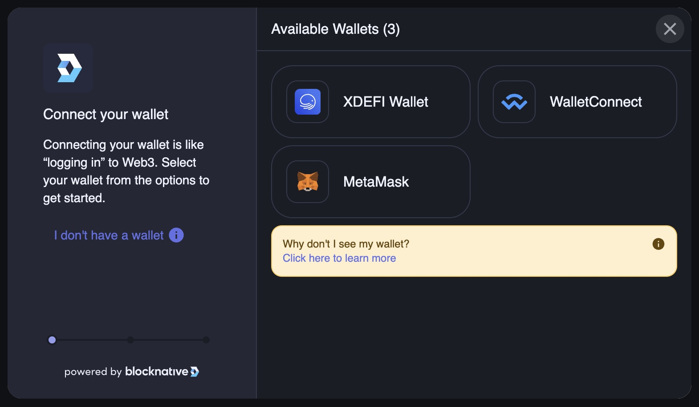
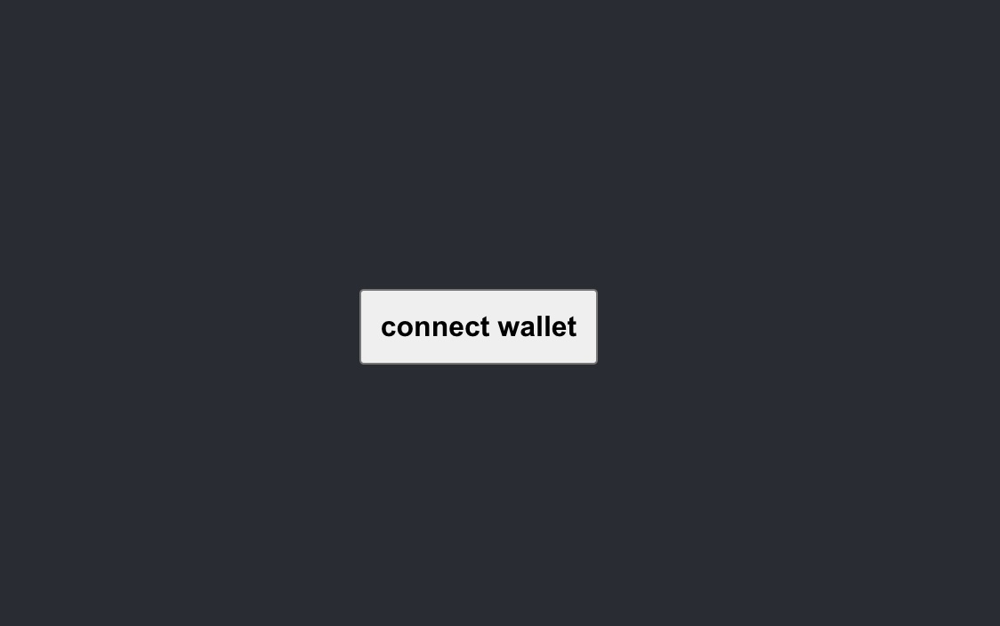
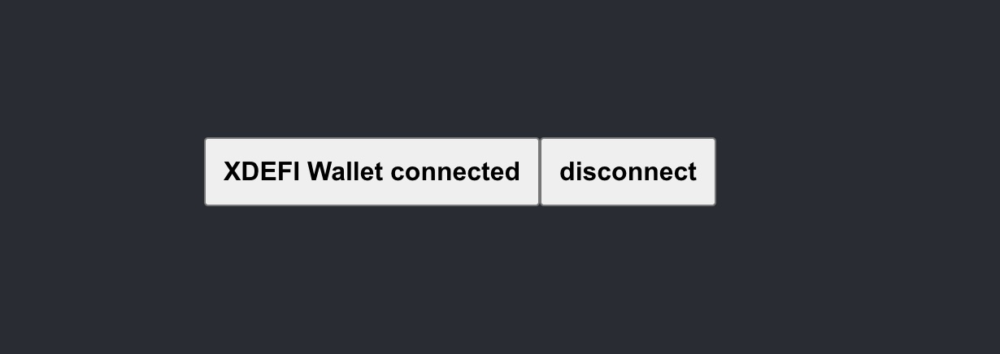
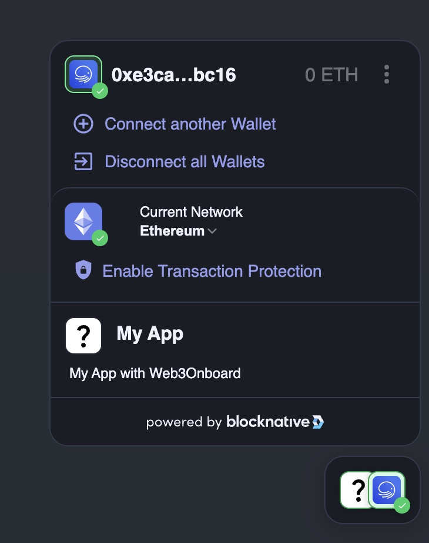
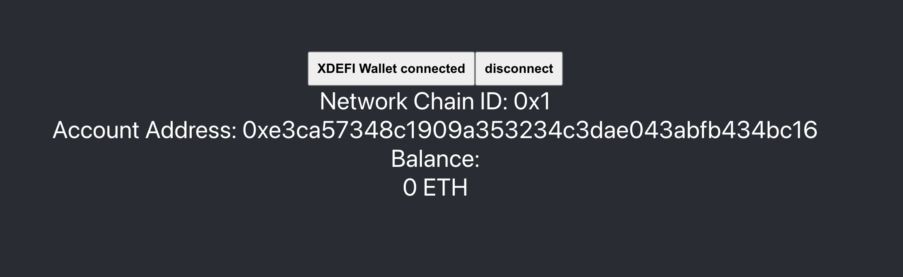

# BlockNative XDEFI Integration

In this tutorial we're going to build dApp which supports multiple wallets using the [Web3-Onboard](https://onboard.blocknative.com) library.



### Get started

Create new react app

```bash
npx create-react-app my-blocknative-app --template typescript
```

> It's always good idea to start explore something new with fresh and pristine codebase to make sure that exploration subject does not interferes with your existing codebase.

I
Install web3-onboard core and react packages.

```bash
yarn add @web3-onboard/core @web3-onboard/react
```

> We'll be using `@web3-onboard/react` which provides some fancy react hooks on top of core package,

Install wallet providers

```bash
yarn add @web3-onboard/xdefi @web3-onboard/injected-wallets @web3-onboard/walletconnect
```

> We'll be using `@web3-onboard/xdefi` package and packages for fallback wallets: `@web3-onboard/walletconnect` and `@web3-onboard/injected-wallets`

### Setting up Web3Onboard provider

First, we need to configure our Web3Onboard.
Let's make Web3Onboard configuration function and complete it step by step

```javascript
import { init } from "@web3-onboard/react";

export function configureWeb3Onboard() {
  const web3Onboard = init({
    wallets: [],
    chains: [],
    theme: "dark",
    appMetadata: {
      name: "My App",
      description: "My App with Web3Onboard",
      recommendedInjectedWallets: [{ name: "XDEFI", url: "https://xdefi.io" }],
    },
  });

  return web3Onboard;
}
```

Now we have our configuration function, but it does not do much yet.
Let's provide some wallets

```javascript
import { init } from "@web3-onboard/react";
import xdefiWalletModule from "@web3-onboard/xdefi"; // [!code ++]
import walletConnectModule from "@web3-onboard/walletconnect"; // [!code ++]
import injectedModule from "@web3-onboard/injected-wallets"; // [!code ++]

export function configureWeb3Onboard() {

  const wallets =
  const web3Onboard = init({
    wallets:[
    xdefiWalletModule(),  // [!code ++]
    walletConnectModule({ projectId: "YOUR_PROJECT_ID" }),  // [!code ++]
    injectedModule(),  // [!code ++]
  ];
    chains: [],
    theme: "dark",
    appMetadata: {
      name: "My App",
      description: "My App with Web3Onboard",
      recommendedInjectedWallets: [{ name: "XDEFI", url: "https://xdefi.io" }],
    },
  });

  return web3Onboard;
}
```

and add supported chains

```javascript
export function configureWeb3Onboard(chains = defaultChainsList) {
  const wallets = [
    xdefiWalletModule(),
    walletConnectModule({ projectId: "YOUR_PROJECT_ID" }),
    injectedModule(),
  ];
  const web3Onboard = init({
    wallets,
    chains: export function configureWeb3Onboard() {
  const web3Onboard = init({
    wallets: [
      xdefiWalletModule(),
      walletConnectModule({ projectId: "YOUR_PROJECT_ID" }),
      injectedModule(),
    ],
    chains: [// [!code ++]
      {// [!code ++]
        id: "0x1",  // [!code ++]
        token: "ETH", // [!code ++]
        label: "Ethereum", // [!code ++]
        rpcUrl: "https://ethereum-rpc.publicnode.com",// [!code ++]
      },// [!code ++]
      {// [!code ++]
        id: "0x2105", // [!code ++]
        token: "ETH", // [!code ++]
        label: "Base",// [!code ++]
        rpcUrl: "https://mainnet.base.org", // [!code ++]
      },// [!code ++]
      {// [!code ++]
        id: "0x89",// [!code ++]
        token: "MATIC",// [!code ++]
        label: "Polygon",// [!code ++]
        rpcUrl: "https://matic-mainnet.chainstacklabs.com",// [!code ++]
      },// [!code ++]
    ],// [!code ++]
    theme: "dark",
    appMetadata: {
      name: "My App",
      description: "My App with Web3Onboard",
      recommendedInjectedWallets: [{ name: "XDEFI", url: "https://xdefi.io" }],
    },
  });

  return web3Onboard;
},
    theme: "dark",
    appMetadata: {
      name: "My App",
      description: "My App with Web3Onboard",
      recommendedInjectedWallets: [{ name: "XDEFI", url: "https://xdefi.io" }],
    },
  });

  return web3Onboard;
}
```

Now, we're ready to set up Web3OnboardProvider. Open your React app enty file and wrap your app with Web3OnboardProvider like on sample below

```javascript
import React from "react";
import ReactDOM from "react-dom/client";
import "./index.css";
import App from "./App";
import { Web3OnboardProvider } from "@web3-onboard/react";
import { configureWeb3Onboard } from "./configureWeb3Onboard";

const root = ReactDOM.createRoot(
  document.getElementById("root") as HTMLElement
);

root.render(
  <React.StrictMode>
    <Web3OnboardProvider web3Onboard={configureWeb3Onboard()}>
      <App />
    </Web3OnboardProvider>
  </React.StrictMode>
);
```

At this point we're done with Web3OnboardProvider setup and finally can start implement our app!

### Connect and disconnect wallet buttons

At this step we will try to achieve following result:

1. Show connect wallet button if there is no connected wallet yet
   
   > Our fancy "connect wallet" button
2. Show Web3Onboard connect wallet modal on "connect wallet" button press
   

   > Web3Onboard connect wallet modal

3. Show disconnect button once we have some wallet connected
   
   > Connected wallet state

Let's proceed with implementation. Here it is:

```tsx
import { useConnectWallet } from "@web3-onboard/react";
import "./App.css";
import { useCallback } from "react";

function App() {
  const [{ wallet, connecting }, connectWallet, disconnectWallet] =
    useConnectWallet();

  const disconnect = useCallback(async () => {
    if (wallet) {
      await disconnectWallet({ label: wallet.label });
    }
  }, [wallet, disconnectWallet]);
  const walletConnected = Boolean(wallet);

  return (
    <div className="App">
      <div className="App-container">
        <section>
          <button disabled={connecting} onClick={() => connectWallet()}>
            {walletConnected
              ? `${wallet?.label} connected`
              : connecting
              ? "connecting"
              : "connect wallet"}
          </button>
          {walletConnected ? (
            <button onClick={disconnect}>disconnect</button>
          ) : null}
        </section>
      </div>
    </div>
  );
}
export default App;
```

Once wallet connected, you must see Blocknative conrol center at the bottom right corner

If you don't need it, you can disable it on Web3Onboard configuration step.

```javascript
const web3Onboard = init({
  accountCenter: {
    mobile: {
      enabled: false,
    },
    desktop: {
      enabled: false,
    },
  },
  ...restOfTheConfig,
});
```

For more detailed information on Account center please visit Web3Onboard docs [for core library](https://onboard.blocknative.com/docs/modules/core#accountcenter) and [for React](https://onboard.blocknative.com/docs/modules/react#useaccountcenter)

### Show connected chain, address and balance

`useConnectWallet` hook exposes a wallet object of type `WalletState` which represents connected wallet state.

Here are some typings which are briefly describe what info we can get from `WalletState` just by taking a quick look

```typescript
interface WalletState {
  label: string;
  icon: string;
  provider: EIP1193Provider;
  accounts: Account[];
  chains: ConnectedChain[];
  instance?: unknown;
}
type Account = {
  address: Address;
  ens: Ens | null;
  uns: Uns | null;
  balance: Balances | null;
  secondaryTokens?: SecondaryTokenBalances[] | null;
};
type Balances = Record<TokenSymbol, string> | null;
type ConnectedChain = {
  id: Chain["id"];
  namespace: Chain["namespace"];
};
```

> Some types omited for brevity. Refer to Web3Onboarding documentation for full info.

Taking a brief look shows that we can get all we need: connected chain, account address and current balance. Let's show that info!

```tsx
{
  walletConnected ? (
    <section>
      <section>Network Chain ID: {wallet?.chains?.[0].id}</section>
      <section>Account Address: {wallet?.accounts?.[0].address}</section>
      <section>
        <div>Balance:</div>

        {Object.keys(wallet?.accounts?.[0].balance || {}).map((tokenSymbol) => (
          <div>
            {wallet?.accounts?.[0].balance?.[tokenSymbol]} {tokenSymbol}
          </div>
        ))}
      </section>
    </section>
  ) : null;
}
```

And here is the result


> Our UI already looks nice. But it will be your homework to make it look gorgeous

### Additional resources

- [Web3Onboard docs](https://onboard.blocknative.com/docs/overview/introduction)
