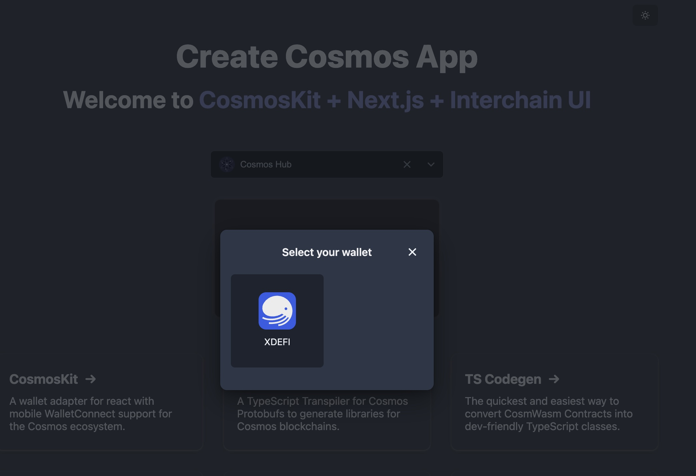

# CosmosKit XDEFI Integration

### Get started

Best way to get started with CosmosKit is to scaffold new app from terminal with [create-cosmos-app](https://github.com/cosmology-tech/create-cosmos-app)

```bash
yarn create cosmos-app
```

Next, you will need to install 2 packages for the XDEFI:

- `@cosmos-kit/xdefi`
- `@cosmos-kit/xdefi-extension`

`@cosmos-kit/xdefi` export all available Ctrl Wallets (currently only extension available), while if you only want to add a particular one, choose `@cosmos-kit/xdefi-extension`

> Note: all these packages export `wallets` and it's an array of `MainWalletBase`

Take `@cosmos-kit/xdefi` for example

### add `@cosmos-kit/xdefi`

```bash
yarn add @cosmos-kit/xdefi
```

### import the wallets

```javascript
import { wallets as xdefi } from "@cosmos-kit/xdefi";
```

### add to your provider

```javascript
function MyCosmosApp({ Component, pageProps }: AppProps) {
  return (
      <ChainProvider
        chains={chains}
        assetLists={assets}
        wallets={[...xdefi]}
        walletConnectOptions={...} // required if `wallets` contains mobile wallets
      >
        <Component {...pageProps} />
      </ChainProvider>
  );
}

export default MyCosmosApp;
```

### we're done!



### Additional resources

- [CosmosKit docs](https://docs.cosmoskit.com/)
