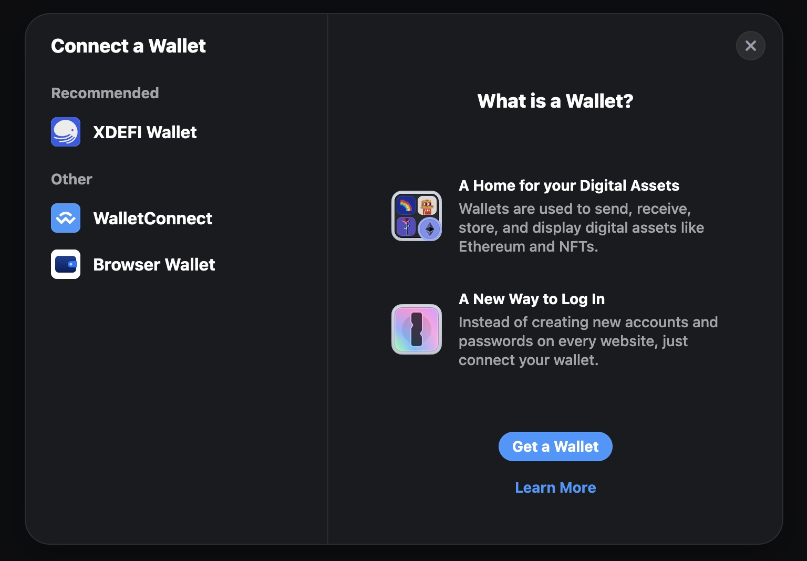

# RainbowKit Ctrl (fka XDEFI) Integration

### Get started

Best way to get started with Rainbowkit is to scaffold new app from terminal

```terminal
npm init @rainbow-me/rainbowkit@latest
```

It will prompt you for a project name, generate a new directory containing a Nextjs boilerplate project, and install all required dependencies

### Add Ctrl Wallet

You can import individual wallets from `@rainbow-me/rainbowkit/wallets` to build your own list of wallets with their necessary connectors. This way you have full control over which wallets to display, and in which order. Wallets will appear on the wallets list in the order you pass them in config.

For example, you can choose to only show Rainbow along with generic fallback wallets.

```javascript
...
import {
  xdefiWallet,
  walletConnectWallet,
  injectedWallet,
  //other wallets
} from "@rainbow-me/rainbowkit/wallets";

const wallets = [
    {
      groupName: "Recommended",
      wallets: [xdefiWallet],
    },
    {
      groupName: "Other",
      wallets: [walletConnectWallet, injectedWallet],
    },
  ]
...
```

> Reminder: always use `walletConnectWallet` and `injectedWallet` to support WalletConnect based wallets and other browser wallets that inject their provider into window

You can then pass your curated list of wallets to RainbowKit `getDefaultConfig`.

```javascript
import { getDefaultConfig } from '@rainbow-me/rainbowkit';

const wallets = [
  {
    groupName: 'Recommended',
    wallets: [xdefiWallet],
  },
  {
    groupName: 'Other',
    wallets: [walletConnectWallet, injectedWallet],
  },
];

const config = getDefaultConfig({
  wallets,
  /* Rest of the config*/
});

const queryClient = new QueryClient();

const App = () => (
  <WagmiProvider config={config}>
    <QueryClientProvider client={queryClient}>
      <RainbowKitProvider {...etc}>{/* Your App */}</RainbowKitProvider>
    </QueryClientProvider>
  </WagmiProvider>
);
```

> RainbowKit `getDefaultConfig` is a wrapper around Wagmi's `createConfig` which does some job for you like creating connectors for your wallets and creating transport for chains passed to config

### Full example

```javascript
import { QueryClient, QueryClientProvider } from '@tanstack/react-query';
import { WagmiProvider } from 'wagmi';
import {
  arbitrum,
  base,
  mainnet,
  optimism,
  polygon,
  zora,
} from 'wagmi/chains';
import { getDefaultConfig, RainbowKitProvider } from '@rainbow-me/rainbowkit';

const config = getDefaultConfig({
  appName: 'RainbowKit App',
  projectId: 'YOUR_PROJECT_ID',// Required for WalletConnect based wallets
  chains: [
    mainnet,
    polygon,
    optimism,
    arbitrum,
    base,
    zora,
  ],
  ssr: true, // We scaffolded Nextjs app, so, need to enable SSR for it
});

const client = new QueryClient();

function MyApp({ Component, pageProps }: AppProps) {
  return (
    <WagmiProvider config={config}>
      <QueryClientProvider client={client}>
        <RainbowKitProvider>
          <Component {...pageProps} />
        </RainbowKitProvider>
      </QueryClientProvider>
    </WagmiProvider>
  );
}
```

### The Wagmi's `createConfig`

If RainbowKit `getDefaultConfig` does not work for you for some reason, you can use Wagmi's `createConfig` directly. See example below for reference

```javascript
import type { AppProps } from "next/app";

import { QueryClient, QueryClientProvider } from "@tanstack/react-query";
import { WagmiProvider, createConfig, http } from "wagmi";
import { arbitrum, base, mainnet, optimism, polygon, zora } from "wagmi/chains";
import {
  connectorsForWallets,
  RainbowKitProvider,
} from "@rainbow-me/rainbowkit";
import {
  xdefiWallet,
  walletConnectWallet,
  injectedWallet,
  //other wallets
} from "@rainbow-me/rainbowkit/wallets";
import { createClient } from "viem";

const connectors = connectorsForWallets(
  // you have to provide CreateConnectorFn[] list for your wallets
  // when using Wagmi's createConfig
  [
    {
      groupName: "Recommended",
      wallets: [xdefiWallet],
    },
    {
      groupName: "Other",
      wallets: [walletConnectWallet, injectedWallet],
    },
  ],
  {
    // Notice that our appName and projectId for WalletConnect now moved
    // from config's top level to connectorsForWallets parameter
    appName: "My Rainbowkit App",
    projectId: "YOUR_PROJECT_ID",
  }
);

const config = createConfig({
  connectors,
  chains: [mainnet, polygon, optimism, arbitrum, base, zora],
  client({ chain }) {
    // you have to provide client factory when using Wagmi's createConfig
    return createClient({ chain, transport: http() });
  },
  ssr: true, // we scaffolded Nextjs app
});

const client = new QueryClient();

function MyApp({ Component, pageProps }: AppProps) {
  return (
    <WagmiProvider config={config}>
      <QueryClientProvider client={client}>
        <RainbowKitProvider>
          <Component {...pageProps} />
        </RainbowKitProvider>
      </QueryClientProvider>
    </WagmiProvider>
  );
}
```

### RainbowKit theming

Once we have set up our wallets list, it's time to pick a proper theme.
RainbowKit has prebuilt light, dark and midnight themes. We'll be using prebuilt dark theme in this guide. For further theme customizations please refer to [RainbowKit theming docs](https://www.rainbowkit.com/docs/theming).

```javascript
import {
  darkTheme, // [!code ++]
} from "@rainbow-me/rainbowkit";
        ...
        <RainbowKitProvider theme={darkTheme()}> // [!code ++]
          <Component {...pageProps} />
        </RainbowKitProvider>
        ...
```

### We're Done! Time to explore results



> Please note: If you have wallet already installed, it will be listed in "Installed" instead of "Recommended". Installed group appears automatically

### Additional resources

- [RainbowKit docs](https://www.rainbowkit.com/docs/)
- [Wagmi createConfig docs](https://wagmi.sh/react/api/createConfig)
