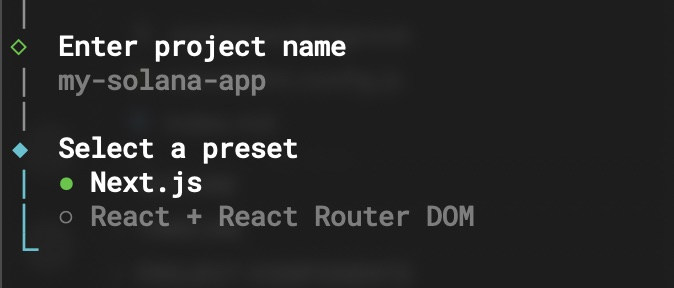
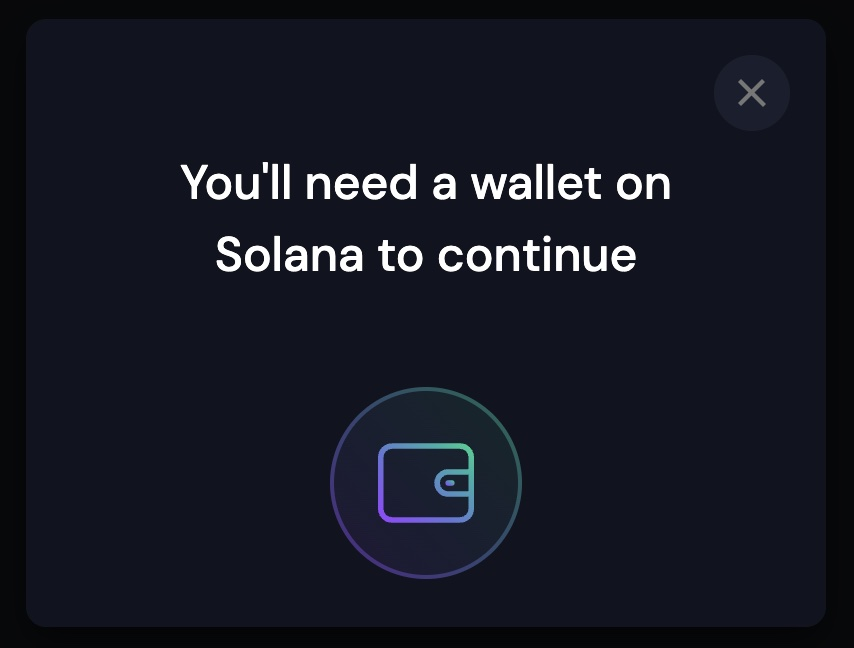
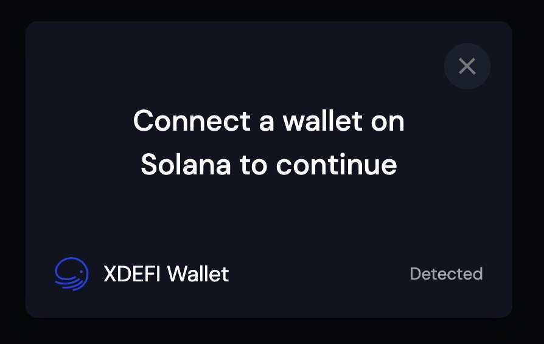
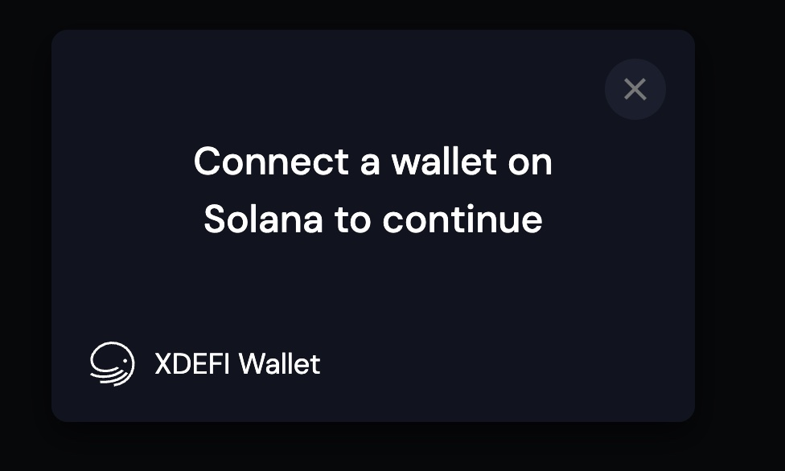

# Solana Adapter Ctrl (fka XDEFI) Integration

### Get started

Best way to start with solana dApps is to use [create-solana-dapp](https://github.com/solana-developers/create-solana-dapp/tree/main/packages/create-solana-dapp)

```bash
npx create-solana-dapp@latest
```

create-solana-dapp supports `React` and `NextJs` version. We'll use `NextJs` version.


### XDEFIWalletAdapter vs Wallet Standard

Ctrl Wallet implements [Wallet Standard](https://github.com/wallet-standard/wallet-standard) and does not require any specific adapter to get started with Solana and Ctrl Wallet.

> You can read more about Wallet Standard [here](https://docs.phantom.app/developer-powertools/wallet-standard).

However, XDEFIWalletAdapter provide Ctrl Wallet installation info when Ctrl Wallet is not installed. Which might be useful in many cases.
So, in case you want maintain supported wallets list, you'll need to use Adapters for parlicular wallets or maintain your own wallet connect modal with supported wallets list.

Here how looks when you have no adapter provided to `WalletProvider` and no wallet installed


> which might be ok for experienced users but pretty confusing for newcomers.

And here how it looks when user have some wallet installed which implements Wallet Standard


### Using Solana Adapter

Solana provides wallet adapters in two flavors: individual packages for each wallet or single tree-shakeable package which contains all wallet adapters available. We'll use later one. you can see all available adapters [here](https://github.com/anza-xyz/wallet-adapter/blob/master/PACKAGES.md#wallets)

```bash
npm install @solana/wallet-adapter-wallets@latest
```

Once installed, you can add Ctrl Wallet by making adding this part of code:

```tsx
import {
  XDEFIWalletAdapter, // [!code ++]
  /* ... other adapters ... */
} from `@solana/wallet-adapter-wallets`;

const onError = useCallback((error: WalletError) => {
  console.error(error);
}, []);

const wallets = useMemo(
  () => [
    new XDEFIWalletAdapter(), // [!code ++]
    // ... other adapters ...
  ],
  []
);

<WalletProvider autoConnect wallets={wallets}  onError={onError}>
```

> `web/components/solana/solana-provider.tsx`

Default behaviour of the `onError` callback is just log error. But what we need from it - is to redirect user to wallet home/installation page when user clicked on not installed wallet inside "Connect Wallet" modal


> it will just log and error and do nothing when you will try to connect not installed wallet

Let's fix this:

```tsx
import {
  Adapter,
  WalletError,
  WalletNotReadyError, // [!code ++]
  WalletReadyState, // [!code ++]
} from '@solana/wallet-adapter-base';

const onError = useCallback((error: WalletError, walletAdapter?: Adapter) => {
  if (// [!code ++]
    error instanceof WalletNotRea // [!code ++]dyError &&
    walletAdapter?.readyState === WalletReadyState.NotDetected // [!code ++]
  ) {// [!code ++]
    window.open(walletAdapter?.url, "_blank"); // [!code ++]
    return; // [!code ++]
  } // [!code ++]
  console.error(error);
}, []);

```

> Now, when user will try to connect Ctrl Wallet while it is not installed, user will be taken to Ctrl Wallet home page in a new window.

### Additional Resources

- [create-solana-dapp](https://github.com/solana-developers/create-solana-dapp)
- [Solana Wallet Adapter](https://github.com/anza-xyz/wallet-adapter)
- [Solana Wallet Adapter Samples](https://github.com/anza-xyz/wallet-adapter/tree/master/packages/starter)
- [Wallet Standard](https://github.com/wallet-standard/wallet-standard)
